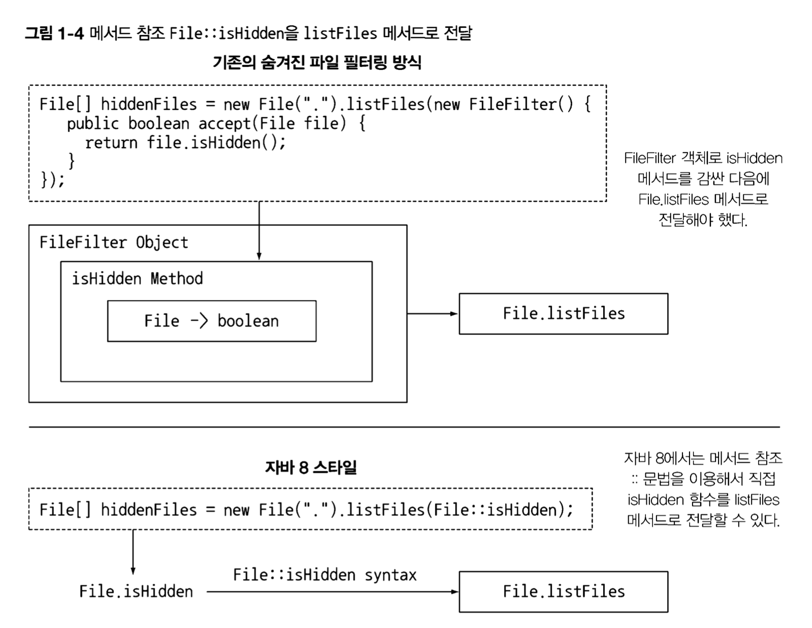

## 1.1 역사의 흐름은 무엇인가?

- 멀티코어 CPU 대중화와 같은 하드웨어적인 변화등이 자바 8에 영향을 미쳤다.
- 지금까지 대부분의 자바 프로그램은 싱글코어만 사용했다.
- 자바 8에서 는 병렬 실행을 새롭고 단순한 방식으로 접근할 수 있는 방법을 제공한다.
- 자바 9에서는 리액티브 프로그래밍이라는 병렬 실행 기법을 지원한다. 이 기법을 사용할 수 있는 상황은 한정되어 있지만 요즘 수요가 많은 고성능 병렬 시 스템에서 특히 인기를 얻고 있는 Rx:Java (리액티브 스트림 툴킷이라고도 불림 )를 표준적인 방식으로지원한다.

### 자바 8은 데이터베이스 질의 언어에서 표현식을 처리하는 것처럼 병렬 연산을 지원하는
스트림이라는 새로운 API를 제공

- 간결한 코드, 멀티코어 프로세서의 쉬운 활용
- 스트림 API - 연산의 동작을 파라미터화 할 수 있는 코드를 전달한다는 사상에 기초
- 메서드에 코드를 전달하는 기법 (메서드참조와 람다)
- 인터페이스의 디폴트 메서드

## 세가지 프로그래밍 개념

### 1.2.2 스트림 처리

- 한 번에 한 개씩 만들어지는 연속적인 데이터 항목들의 모임.
- 스트림 패키지에 정의된 Stream〈T〉는T형식으로구성된 일련의 항목을 의미
- 데이터베이스 질의처럼 고수준으로 추상화해서 일련의 스트림으로 만들어서 처리 할 수 있다.

### 1.2.3 동작 파라미터화로 메서드에 코드 전달하기

- 코드 일부를 API로 전달하는 기능
- 메서드를 다른 메서드의 인수로 넘겨주는 기능을 제공

### 1.2.4 병렬성과 공유 가변 데이터

- 병렬성을 공짜로 얻을 수 있다. → 스트림 메서드로 전달하는 코드의 동작 방식을 조금 바꿔야 한다.
- 다른 코드와 동시에 실행하더라도 안전하게 실행 할 수 있는 코드를 만들려면 공유된 가변데이터(Sharedmutable data)에 접근하지 않아야 한다. → 순수함수, 부작용 없는 함수, 상태없는 함수

## 1.3 자바 함수

프로그래밍 언어에서 함수 function 라는 용어는 메서드method 특히 정적 메서드static method와 같은 의미로 사용된다. 자바의 힘수는 이에 더해 수학적인 함수처럼 사용되며 부작용을 일으키지 않는 함수를 의미한다.

프로그래밍 언어의 핵심은 값을 바꾸는 것이다. 이 값을 일급(first-class) 값 (또는 시민 citizen)이라고 부른다.

자바의 메서드,클래스는 자유롭게 전달 할 수 없어서 이급 시민이다.
예를들어 런타임에 메서드를 전달할 수 있다면, 즉 메서드를 일급 시민으로 만들면 프로그래밍에 유용하게 활용 할 수 있다. 자바 8 설계자들은 이급 시민을 일급 시민으로 바꿀 수 있는 기능을 추가했다.

### 1.3.1 메서드 참조 (method reference)

준비된 함수를 메서드참조 :: 를 통해서 전달 할 수 있다.

- 주어진 파일이 숨겨져 있는지 여부를 알려주는 메서드

```java
File[] hiddenFiles = new File(".").listFiles(new FileFilter() {
	 public boolean accept(File file) {
		return file.isHidden(); //숨겨진 파일 필터링
	}
});
```

- 메서드 참조 :: (’이 메서드를 값으로 사용하라는 의미')를 사용한 메서드

```java
File[] hiddenFiles= new File(".").listFiles(File::isHidden);
```


### 람다 : 익명함수

자바 8에서는 (기명 named) 메서드를 일급값으로 취급할 뿐 아니라 람다(익명 힘수 anonymous functions)를 포함하여 함수도 값으로 취급 할 수 있다.

- 람다를 이용하면 간결하게 코드를 구현 할 수 있다.

### 1.3.2 코드 넘겨주기 : 예제

Apple 클래스와 getColor 메서드가 있고, Apples 리스트를 포함하는 변수 inventory가 있다고 가정하자. 이때 모든 녹색 사과를 선택해서 리스트를 반환하는 프로그램을 구현하려고 한다. 이처럼 특정 항목을 선택해서 반환하는 동작을 filter라고 한다.

자바 8 이전

```java
public static List<Apple> filterGreenApples(List<Apple> inventory) {
    List<Apple> result = new ArrayList<>();
    for (Apple apple : inventory) {
      if ("green".equals(apple.getColor())) {
        result.add(apple);
      }
    }
    return result;
  }

```

사과를 무게로 필터링하는 경우는 다음과 같을 것이다.

```java
public static List<Apple> filterHeavyApples(List<Apple> inventory) {
    List<Apple> result = new ArrayList<>();
    for (Apple apple : inventory) {
      if (apple.getWeight() > 150) {
        result.add(apple);
      }
    }
    return result;
  }

```

소프트웨어공학적인 면에서 복붙의 단점 → 어떤 코드에 버그가 있다면 복붙한 모든 코드를 고쳐야 한다. 위의 두 코드는 한 줄의 코드만 다르다. 이러한 위험에서 안전하지 않기도 하다.

자바 8에서는 코드를 인수로 넘겨줄 수 있으므로 filter 메서드를 중복으로 구현할 필요가 없다. 자바 8에서는 다음과 같이 구현할 수 있다.

```java
public static boolean isGreenApple(Apple apple) {
    return "green".equals(apple.getColor());
  }

  public static boolean isHeavyApple(Apple apple) {
    return apple.getWeight() > 150;
  }

  public static List<Apple> filterApples(List<Apple> inventory, Predicate<Apple> p) {
    List<Apple> result = new ArrayList<>();
    for (Apple apple : inventory) {
      if (p.test(apple)) {
        result.add(apple);
      }
    }
    return result;
  }

```

다음과 같이 호출할 수 있다.

```java
filterApples(inventory, Apple::isGreenApple);
filterApples(inventory, Apple::isHeavyApple);

```

### Predicate

filterApples는 Apple::isGreenApple 메서드를 Predicate<Apple>이라는 타입의 파라미터로 받는다. 인수로 값을 받아 true나 false를 반환하는 함수를 프레디케이트라고 한다.

## 1.4 스트림

리스트에서 고가의 트랜잭션Tran.saction(거래 )만 필터링한 다음에 통화로 결과를 그룹화해야 한다고 가정하자. 다음 코드처럼 많은 기본 코드를 구현해야 한다.

```java
import static java.util.stream.Collectors.groupingBy; 

Map<Currency, List<Transaction>> transactionsByCurrencies =
	transactions.stream()
		.filter((Transaction t) -> t.getPrice() > 1000) // 고가의트랜잭션필터링 
		.collect(groupingBy(Transaction::getCurrency)); // 통화로그룹화함
```

- 스트림 API를 이용하면 컬렉션 API와는 상당히 다른 방식으로 데이터를 처리 할 수 있다.
- 컬렉션은 for-each(외부반복)을 이용해 각 요소를 반복하며 작업을 수행했다. 하지만 스트림 API에서는 라이브러리 내부에서 모든 데이터가 처리된다. (내부반복)

### 1.4.1 멀티스레딩

스트림 API는 기존 자바에서 발생하던 두가지 문제를 모두 해결했다.

- 컬렉션을 처리하면서 발생하는 모호함과 반복적인 코드 문제
- 멀티코어 활용 어려움

자주 반복되는 패턴으로 주어진 조건에 따라 데이터를 ‘필터링'하거나 , 데이터를 ‘추출' 하거나, 데이터를 ‘그룹화'하는 기능등의 반복되는 패턴을 제공한다. 또한 이러한 동작들을 쉽게 병렬화 할 수 있다.

컬렉션은 어떻게 데이터를 저장하고 접근할지에 중점을 두는 반면 스트림은 데이터에 어떤 계산을 할것인지 묘사하는 것에 중점을 둔다.

### 1.5 디폴트 메서드와 자바 모듈

자바 모듈 시스템은 모듈을 정의하는 문법을 제공한다. 이를 통해 패키지 모음을 포함하는 모듈을 정의할 수 있다.

모듈 덕분에 JAR 같은 컴포넌트에 구조를 적용할 수 있으며 문서화와 모듈 확인 작업이 용이해졌다.

또한 자바 8에서는 인터페이스를 쉽게 바꿀 수 있도록 디폴트 메서드를 지원한다.

구현 클래스에서 구현하지 않아도 되는 메서드를 인터페이스에 추가할 수 있는 기능을 제공하며, 메서드 본문은 클래스 구현이 아니라 인터페이스 일부로 포함된다.

예를 들어 자바 8에서는 List에 직접 sort 메서드를 호출할 수 있다. 이는 자바 8의 List 인터페이스에 다음과 같은 디폴트 메서드 정의가 추가되었기 때문이다.

```java
default void sort(Comparator<? super E> C) {
  Collections.sort(this, c);
}
```

### 1.6 함수형 프로그래밍에서 가져온 다른 유용한 아이디어

함수형 언어에는 명시적으로 서술형의 데이터를 이용해 null을 회피하는 기법이 있다.

자바 8에서는 NullPointer 예외를 피할 수 있도록 도와주는 Optional<T> 클래스를 제공한다.

Optional〈T〉는 값을 갖거나 갖지 않을 수 있는 컨데이너 객체다.

Optional<T>는 값이 없는 상황을 어떻게 처리할지 명시적으로 구현하는 메서드를 포함하고 있다.

### 1.7 마치며

- 언어 생태계의 모든 언어는 변화해서 살아남거나 그대로 머물면서 사라지게 된다. 지금은 자바의 위치가 견고하지만 코볼과 같은 언어의 선례를 떠올리면 자바가 영원히 지배적인 위치를 유지할 수 있는 것은 아닐 수 있다.
- 자바 8은 프로그램을 더 효과적이고 간결하게 구현할 수 있는 새로운 개념과 기능을 제공한다.
- 기존의 자바 프로그래밍 기법으로는 멀티코어 프로세서를 온전히 활용하기 어렵다.
- 함수는 일급값이다. 메서드를 어떻게 함수형값으로 넘겨주는지, 익명 함수(람다)를 어떻게 구현하지는 기억하자.
- 자바 8의 스트림 개념 중 일부는 컬렉션에서 가져온 것이다. 스트림과 컬렉션을 적절하게 활용하면 스트림의 인수를 병렬로 처리할 수 있으며 더 가독성이 좋은 코드를 구현할 수 있다.
- 기존 자바 기능으로는 대규모 컴포넌트 기반 프로그래밍 그리고 진화하는 시스템의 인터페이스를 적절하게 대응하기 어려웠다. 자바 9에서는 모듈을 이용해 시스템의 구조를 만들 수 있고 디폴트 메소드를 이용해 기존 인터페이스를 구현하는 클래스를 바꾸지 않고도 인터페이스를 변경할 수 있다.
- 함수형 프로그래밍에서 null 처리 방법과 패턴 매칭 활용 등 흥미로운 기법을 발견했다.